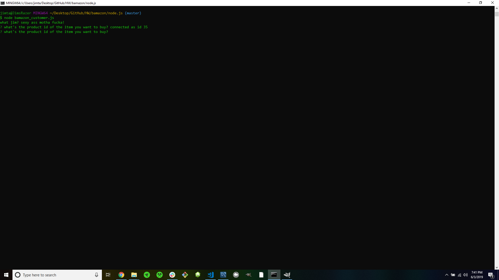
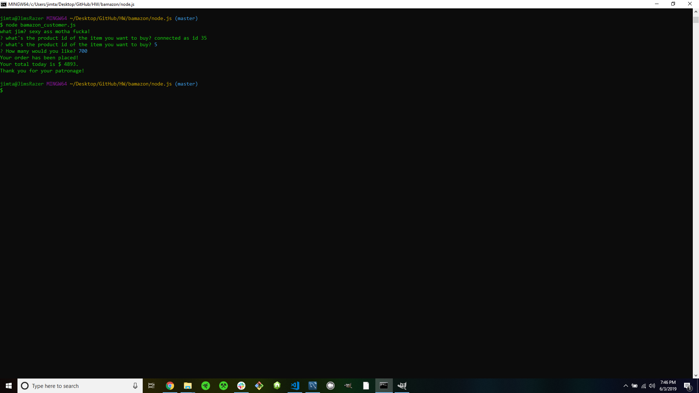
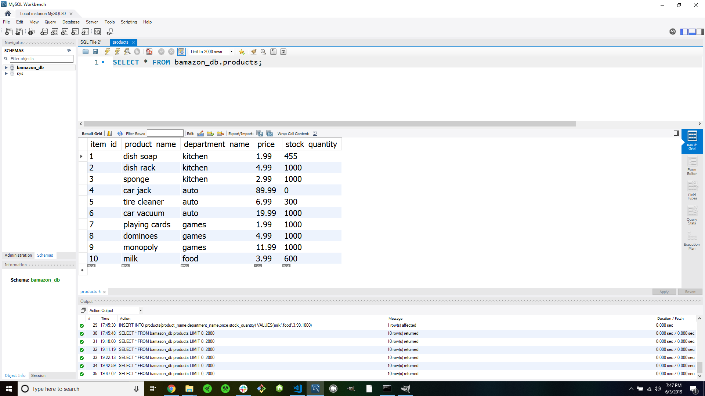

# bamazon
A CLI using mySQL and node.js

### You can make your own 'store' database and use node to interact and make orders!

## Here is what the app looks like in action!

## Database before using the app..

## What the app looks like when called..

## What the app looks like after used..

## Database after using the app (order updates current inventory)

